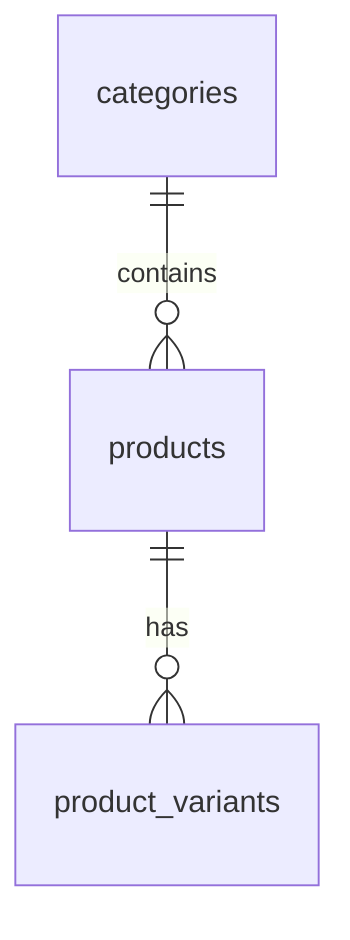
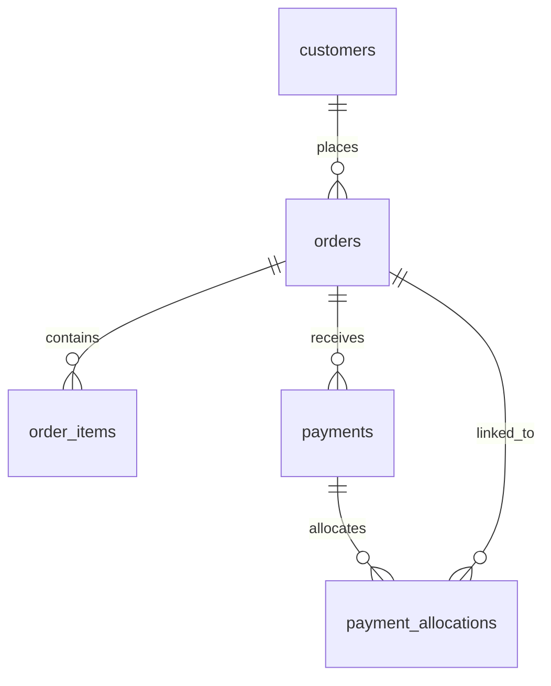
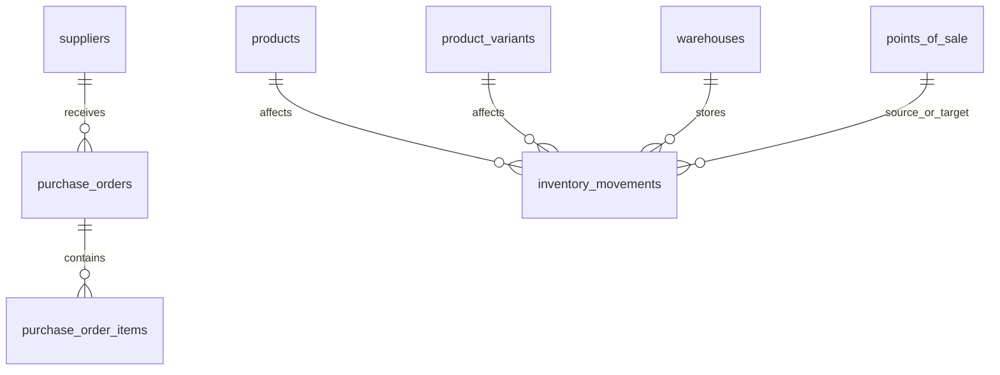
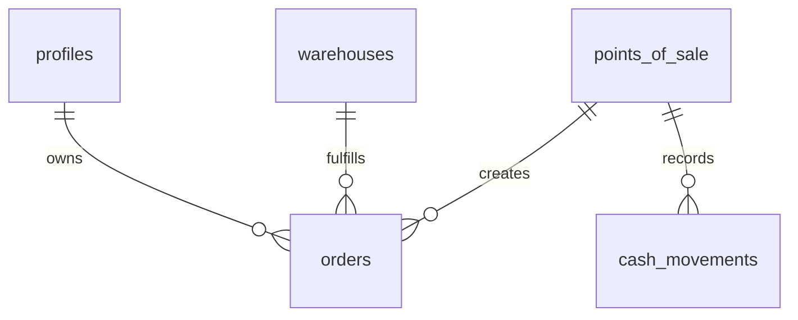

# Supabase Architecture Reference for Codex

Project: **JYP Trend**  
Backend: **Supabase (PostgreSQL + Auth + Storage)**  
Purpose: **Sales management platform** for catalog, customers, orders, payments, inventory, purchasing, cash control, and reporting.

This document is designed for:
- developers working on the repository
- AI coding assistants such as Codex / Copilot / ChatGPT
- technical onboarding and architectural reference

---

## 1. Architecture Summary

The backend is implemented on **Supabase** using:

- **PostgreSQL** for relational data
- **Supabase Auth** for user identity
- **Supabase Storage** for product images
- **RLS (Row Level Security)** on all business tables
- **SQL views** and **materialized views** for reporting

Main application schema:

```txt
public
```

Other relevant schemas:

```txt
auth
storage
graphql
graphql_public
extensions
information_schema
```

---

## 2. Current Database Scope

The `public` schema contains **16 tables**, **6 views**, and **1 materialized view**.

### Tables

```txt
cash_movements
categories
customers
inventory_movements
order_items
orders
payment_allocations
payments
points_of_sale
product_variants
products
profiles
purchase_order_items
purchase_orders
suppliers
warehouses
```

### Views

```txt
v_inventory_stock_by_product
v_inventory_stock_by_variant
v_order_payment_summary
v_order_summary
v_sales_by_day
v_sales_by_product
```

### Materialized Views

```txt
mv_sales_by_product
```

---

## 3. Core Domain Model

### Product model



- `categories` = logical grouping
- `products` = product master
- `product_variants` = sellable SKU-level variants

### Sales model



### Purchasing and inventory model



### Commercial operations model



---

## 4. Table-by-Table Reference

## 4.1 categories

Purpose: product classification for catalog navigation and grouping.

Key ideas:
- public catalog only shows active categories
- category is parent of products

Typical fields:
- `id`
- `created_at`
- `updated_at`
- `name`
- `slug`
- `order`
- `active`

Relationships:
- `products.category_id -> categories.id`

Notes for Codex:
- do not invent nested category tables
- use `active = true` for public catalog queries
- preserve `slug` if frontend routes depend on it

---

## 4.2 products

Purpose: product master record.

Typical fields:
- `id`
- `created_at`
- `updated_at`
- `name`
- `description`
- `price`
- `category_id`
- `image_path`
- `active`

Relationships:
- `products.category_id -> categories.id`
- parent of `product_variants`
- parent of `order_items`
- parent of `purchase_order_items`
- parent of `inventory_movements`

Notes for Codex:
- `products` is not the SKU table; `product_variants` is the detailed sellable layer
- `image_path` points to Supabase Storage bucket `catalog`
- write access is restricted; do not assume any authenticated user can update products

Recommended query pattern for public catalog:
```javascript
const { data, error } = await supabase
  .from('products')
  .select('*')
  .eq('active', true)
```

---

## 4.3 product_variants

Purpose: SKU-level product variants.

Examples:
- size
- color
- fragrance
- capacity
- presentation

Typical fields:
- `id`
- `product_id`
- `user_id`
- `sku`
- `barcode`
- `variant_name`
- `option1_name`
- `option1_value`
- `option2_name`
- `option2_value`
- `option3_name`
- `option3_value`
- `cost_price`
- `sale_price`
- `currency_code`
- `weight`
- `active`
- `created_at`
- `updated_at`

Relationships:
- `product_variants.product_id -> products.id`

Notes for Codex:
- use `variant_id` when working with stock-sensitive operations
- `sku` and `barcode` are identifiers for integrations/search
- `sale_price` may override or complement product base price depending on business logic
- for sales and stock, prefer variant-level logic whenever available

---

## 4.4 customers

Purpose: customer master data.

Typical fields:
- `id`
- `user_id`
- `full_name`
- `phone`
- `email`
- `notes`
- `is_active`
- `created_at`
- `updated_at`

Relationships:
- `orders.customer_id -> customers.id`
- `payments.customer_id -> customers.id`

Notes for Codex:
- customers are user-scoped by RLS
- do not expose one seller's customers to another seller
- keep customer snapshot values in orders when historical accuracy matters

---

## 4.5 orders

Purpose: sales order header.

Important fields:
- `id`
- `user_id`
- `customer_id`
- `point_of_sale_id`
- `warehouse_id`
- `created_at`
- `updated_at`
- `status`
- `order_status`
- `payment_status`
- `order_number`
- `customer_name`
- `customer_phone`
- `notes`
- `currency_code`
- `exchange_rate`
- `subtotal`
- `discount_amount`
- `shipping_amount`
- `tax_amount`
- `grand_total`
- `total`
- `delivery_method`
- `delivery_address`
- `scheduled_delivery_at`
- `confirmed_at`
- `cancelled_at`
- `closed_at`
- `customer_name_snapshot`
- `customer_phone_snapshot`
- `customer_email_snapshot`
- `customer_address_snapshot`

Relationships:
- `orders.customer_id -> customers.id`
- `orders.point_of_sale_id -> points_of_sale.id`
- `orders.warehouse_id -> warehouses.id`

Status fields:
- `status` is the system/internal state
- `order_status` is the commercial lifecycle
- `payment_status` is the payment lifecycle

Allowed values:
```txt
status: draft | submitted | cancelled
order_status: NUEVO | CONFIRMADO | ENVIADO | ENTREGADO | CANCELADO
payment_status: PENDIENTE | PARCIAL | PAGADO | FALLIDO | CANCELADO
```

Notes for Codex:
- do not calculate totals manually in app code if DB triggers already maintain them
- `order_number` is unique and should be treated as business-facing identifier
- keep snapshot columns populated when rendering historical documents
- `total` and `grand_total` are related; preserve existing calculation rules

---

## 4.6 order_items

Purpose: sales order lines.

Typical fields:
- `id`
- `order_id`
- `product_id`
- `variant_id`
- `qty`
- `unit_price`
- `subtotal`
- `discount_amount`
- `tax_amount`
- `cost_price_snapshot`
- `product_name_snapshot`
- `variant_name_snapshot`
- `sku_snapshot`
- `position`
- `created_at`
- `updated_at`

Relationships:
- `order_items.order_id -> orders.id`
- `order_items.product_id -> products.id`
- `order_items.variant_id -> product_variants.id`

Notes for Codex:
- `subtotal` is maintained by trigger from `qty * unit_price`
- use snapshot columns for immutable invoice/order history
- if `variant_id` is present, treat it as the primary sellable unit
- never insert `order_items` without a valid `order_id`

---

## 4.7 payments

Purpose: records actual payment transactions.

Typical fields:
- `id`
- `order_id`
- `customer_id`
- `user_id`
- `amount`
- `currency_code`
- `payment_method`
- `payment_status`
- `payment_date`
- `reference_number`
- `external_reference`
- `notes`
- `created_at`
- `updated_at`

Relationships:
- `payments.order_id -> orders.id`
- `payments.customer_id -> customers.id`

Allowed `payment_status` values:
```txt
PENDIENTE
PARCIAL
PAGADO
FALLIDO
CANCELADO
```

Notes for Codex:
- payments may later be distributed using `payment_allocations`
- do not assume one payment always means one fully paid order
- use `payment_method` for cash, transfer, Mercado Pago, etc.

---

## 4.8 payment_allocations

Purpose: allocate one payment to one or more orders.

Typical fields:
- `id`
- `user_id`
- `payment_id`
- `order_id`
- `amount`
- `created_at`
- `updated_at`

Relationships:
- `payment_allocations.payment_id -> payments.id`
- `payment_allocations.order_id -> orders.id`

Notes for Codex:
- use this table for partial payments or cross-order applications
- the pair `(payment_id, order_id)` is unique
- reporting should use allocations for true paid-vs-pending balance

---

## 4.9 points_of_sale

Purpose: identifies commercial channels or sales points.

Examples:
- web store
- showroom
- physical store
- WhatsApp sales
- marketplace channel

Typical fields:
- `id`
- `user_id`
- `name`
- `code`
- `description`
- `active`
- `created_at`
- `updated_at`

Relationships:
- referenced by `orders`
- referenced by `cash_movements`
- referenced by `purchase_orders`
- referenced by `inventory_movements`

Notes for Codex:
- use this for channel-level reports
- do not confuse POS with `warehouses`

---

## 4.10 cash_movements

Purpose: money movement ledger per point of sale.

Typical fields:
- `id`
- `user_id`
- `point_of_sale_id`
- `movement_type`
- `payment_method`
- `amount`
- `currency_code`
- `order_id`
- `payment_id`
- `reference_type`
- `reference_id`
- `notes`
- `created_at`
- `updated_at`

Movement types:
```txt
IN
OUT
TRANSFER_IN
TRANSFER_OUT
ADJUSTMENT
```

Notes for Codex:
- use for caja / reconciliation workflows
- not every payment implies one cash movement automatically unless your app enforces it
- preserve sign semantics according to business rules

---

## 4.11 suppliers

Purpose: supplier master.

Typical fields:
- `id`
- `user_id`
- `name`
- `phone`
- `email`
- `contact_name`
- `notes`
- `is_active`
- `created_at`
- `updated_at`

Notes for Codex:
- used by purchasing workflows only
- supplier data is owner-scoped by `user_id`

---

## 4.12 purchase_orders

Purpose: purchasing document header.

Typical fields:
- `id`
- `user_id`
- `supplier_id`
- `point_of_sale_id`
- `created_at`
- `updated_at`
- `expected_date`
- `received_at`
- `status`
- `notes`
- `currency_code`
- `exchange_rate`
- `subtotal`
- `discount_amount`
- `shipping_amount`
- `tax_amount`
- `total`

Relationships:
- `purchase_orders.supplier_id -> suppliers.id`
- `purchase_orders.point_of_sale_id -> points_of_sale.id`

Allowed status values:
```txt
DRAFT
CONFIRMED
PARTIAL
RECEIVED
CANCELLED
```

Notes for Codex:
- use for procurement logic, not customer orders
- totals are maintained from `purchase_order_items`

---

## 4.13 purchase_order_items

Purpose: lines inside a purchase order.

Typical fields:
- `id`
- `purchase_order_id`
- `product_id`
- `variant_id`
- `qty`
- `unit_cost`
- `subtotal`
- `product_name_snapshot`
- `variant_name_snapshot`
- `sku_snapshot`
- `created_at`
- `updated_at`

Relationships:
- `purchase_order_items.purchase_order_id -> purchase_orders.id`
- `purchase_order_items.product_id -> products.id`
- `purchase_order_items.variant_id -> product_variants.id`

Notes for Codex:
- `subtotal` is maintained from `qty * unit_cost`
- use as source for inventory inbound processes

---

## 4.14 inventory_movements

Purpose: inventory ledger.

Typical fields:
- `id`
- `user_id`
- `product_id`
- `variant_id`
- `warehouse_id`
- `point_of_sale_id`
- `movement_type`
- `qty`
- `unit_cost`
- `reference_type`
- `reference_id`
- `notes`
- `created_at`
- `updated_at`

Allowed movement types:
```txt
PURCHASE
SALE
ADJUSTMENT
RETURN
TRANSFER
LOSS
```

Relationships:
- `inventory_movements.product_id -> products.id`
- `inventory_movements.variant_id -> product_variants.id`
- `inventory_movements.warehouse_id -> warehouses.id`
- `inventory_movements.point_of_sale_id -> points_of_sale.id`

Notes for Codex:
- stock is **not** a static field in products
- stock is derived by summing movements
- prefer warehouse + variant granularity for operational accuracy
- use views for stock reporting instead of recalculating ad hoc everywhere

---

## 4.15 warehouses

Purpose: inventory locations.

Typical fields:
- `id`
- `user_id`
- `name`
- `code`
- `description`
- `is_active`
- `created_at`
- `updated_at`

Relationships:
- referenced by `orders`
- referenced by `inventory_movements`

Notes for Codex:
- model storage locations separately from commercial channels
- warehouse can be null in some historical records, so code defensively

---

## 4.16 profiles

Purpose: application-level user profile and authorization role.

Typical fields:
- `id` (same as `auth.users.id`)
- `email`
- `full_name`
- `role`
- `is_active`
- `created_at`
- `updated_at`

Allowed roles:
```txt
admin
seller
viewer
```

Notes for Codex:
- `profiles` complements Supabase Auth
- use `profiles.role` to gate admin-only actions
- do not store role logic only in frontend

---

## 5. Views and Reporting Layer

### v_inventory_stock_by_product

Aggregated stock at product level.

Use when:
- showing simplified stock dashboards
- variant detail is not needed

### v_inventory_stock_by_variant

Aggregated stock at variant level.

Use when:
- SKU stock matters
- operational picking / replenishment workflows are implemented

### v_order_summary

Simplified order reporting view.

Use when:
- listing orders in dashboards
- exporting order summaries

### v_order_payment_summary

Order total vs allocated payments.

Use when:
- aging / debt tracking
- pending balance reporting

### v_sales_by_day

Daily sales aggregation.

Use when:
- time-series charts
- sales dashboard KPI cards

### v_sales_by_product

Sales aggregated by product / variant.

Use when:
- best sellers
- category performance
- assortment analysis

### mv_sales_by_product

Materialized view for precomputed product sales.

Use when:
- high-performance reporting
- repeated product ranking dashboards

Refresh function:
```sql
select public.refresh_mv_sales_by_product();
```

Notes for Codex:
- prefer views for dashboards instead of raw heavy joins in frontend
- use materialized view for expensive repeated analytics queries

---

## 6. RLS and Security Model

RLS is enabled on all public tables.

General principles:
- each user only sees their own operational data through `user_id`
- admin role has elevated access where configured
- public catalog access is restricted to active catalog records
- write operations on sensitive catalog entities are admin-controlled

Examples:
- `customers`: owner-scoped
- `orders`: owner-scoped
- `payments`: owner-scoped
- `products`: admin write
- `categories`: admin write
- `profiles`: self or admin depending on action

Notes for Codex:
- always assume server-side security matters
- do not bypass RLS assumptions in generated code
- when writing Edge Functions or server code, use service role carefully and explicitly

---

## 7. Storage Model

Bucket:
```txt
catalog
```

Purpose:
- product images

Typical structure:
```txt
catalog/
  products/
    <product_id>.jpg
```

Database link:
- `products.image_path`

Notes for Codex:
- keep storage paths in DB, not full public URLs when possible
- generate signed/public URLs at application layer as needed
- avoid duplicating asset metadata in many tables

---

## 8. Naming Conventions

Tables:
```txt
plural lowercase
```

Columns:
```txt
snake_case
```

IDs:
```txt
uuid primary keys
```

Timestamps:
```txt
created_at
updated_at
```

Foreign keys:
```txt
<entity>_id
```

Guidelines for generated code:
- preserve exact table and column names
- do not invent camelCase DB columns
- map frontend camelCase only in DTO/service layer if needed

---

## 9. Trigger and Function Behavior

Important DB-side automation:

### Generic timestamp maintenance
- `set_updated_at()`

### Order item subtotal
- `order_items_set_subtotal()`

### Purchase order item subtotal
- `purchase_order_items_set_subtotal()`

### Order totals recalculation
- `set_order_totals()`

### Purchase order totals recalculation
- `set_purchase_order_totals()`

### Materialized view refresh
- `refresh_mv_sales_by_product()`

### Auto profile creation
- `handle_new_user_profile()`

Notes for Codex:
- totals and subtotals are not purely frontend concerns
- DB triggers already enforce part of the calculation lifecycle
- generated code should not fight the database behavior

---

## 10. Practical Rules for Codex

When generating code for this repo, follow these rules strictly:

### Database rules
- Do not invent tables, columns, enums, or relationships
- Prefer `variant_id` when inventory precision matters
- Use `inventory_movements` as source of truth for stock
- Use `payment_allocations` as source of truth for allocated payments
- Treat `profiles.role` as the authorization layer for admin actions
- Respect existing triggers for totals and timestamps

### Query rules
- For catalog browsing, filter active records
- For user operations, assume RLS filters by `auth.uid()`
- For analytics, prefer views and materialized views
- For historical rendering, use snapshot columns from orders/order_items

### Mutation rules
- Create `orders` before `order_items`
- Refrain from writing manual totals if DB triggers are authoritative
- Use transactions in server-side code when creating documents with child rows
- For stock changes, create explicit `inventory_movements`
- For money changes, create explicit `cash_movements` when applicable

### Storage rules
- Product images belong in Supabase Storage bucket `catalog`
- Persist the path in `products.image_path`
- Do not hardcode full image URLs in the database unless intentionally required

### Authorization rules
- Do not assume `authenticated` means admin
- Use `profiles.role = 'admin'` for privileged catalog writes
- Never expose cross-user data in client code

---

## 11. Suggested Repository Docs Structure

Recommended documentation layout for this repo:

```txt
/docs/supabase-architecture.md
/docs/supabase-data-dictionary.md
/docs/supabase-reporting.md
/docs/codex-context.md
/docs/frontend-data-contract.md
```

Recommended purpose:
- `supabase-architecture.md` -> architecture and relationships
- `supabase-data-dictionary.md` -> field-by-field business dictionary
- `supabase-reporting.md` -> reporting views and KPIs
- `codex-context.md` -> shorter AI-focused operational rules
- `frontend-data-contract.md` -> UI/backend contract

---

## 12. Recommended Example Queries

### Public catalog with category and variants
```javascript
const { data, error } = await supabase
  .from('products')
  .select(`
    id,
    name,
    description,
    price,
    image_path,
    active,
    categories (
      id,
      name,
      slug
    ),
    product_variants (
      id,
      sku,
      variant_name,
      sale_price,
      active
    )
  `)
  .eq('active', true)
```

### User orders summary
```javascript
const { data, error } = await supabase
  .from('v_order_summary')
  .select('*')
  .order('created_at', { ascending: false })
```

### Pending payment summary
```javascript
const { data, error } = await supabase
  .from('v_order_payment_summary')
  .select('*')
```

### Stock by variant
```javascript
const { data, error } = await supabase
  .from('v_inventory_stock_by_variant')
  .select('*')
```

---

## 13. Final Notes

This document reflects the **final evolved model** after:
- Phase 1: security, constraints, payments, timestamps
- Phase 2: purchasing, inventory, POS, cash, operational totals
- Phase 3: roles, variants, warehouses, payment allocations, reporting

This is the source of truth for:
- understanding the Supabase backend
- guiding Codex and AI assistants
- preventing hallucinated schema generation
- onboarding future development

